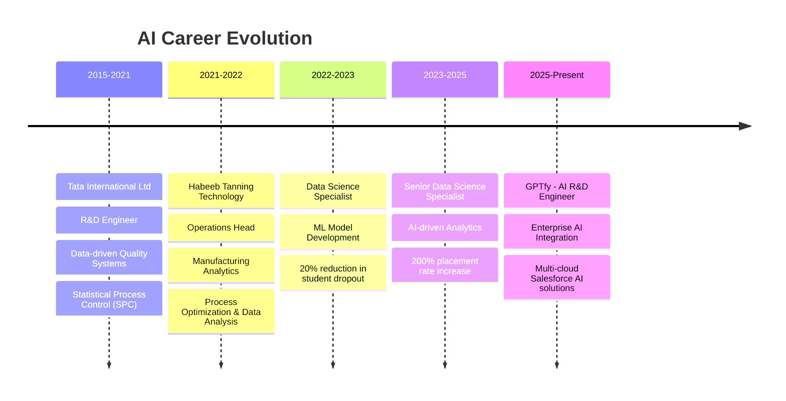

# 🚀 Karthick Thangadurai

<div align="center">
  
[](https://git.io/typing-svg)


</div>

---

## 🎯 **About Me**

> *"The best way to predict the future is to invent it"* - Alan Kay

🔬 **AI Research & Development Engineer @ GPTfy** with 10+ years of experience building intelligent enterprise solutions  
🎓 **AWS Certified Cloud Practitioner** | **IATF 16949:2016 Certified Internal Auditor**  
🌟 Specialized in **Enterprise AI Integration**, **RAG Architecture**, and **Conversational AI Systems**  
🤖 Building scalable AI solutions across **GCP, Azure, AWS** with **Salesforce CRM intelligence**  
📈 **Increased student placement rates by 200%** and delivered **enterprise AI demos** driving client adoption

### 🔥 **Current Focus**
```python
current_mission = {
    "role": "AI R&D Engineer @ GPTfy",
    "building": ["Enterprise RAG Solutions", "Salesforce-AI Integrations", "Conversational AI Workflows"],
    "researching": ["Vector Database Optimization", "Multi-Cloud AI Architecture", "DialogFlow Intelligence"],
    "expertise": ["LangChain PoCs", "FAISS & Pinecone", "Pre-sales AI Prototypes"],
    "impact": "Driving client adoption through impactful technical storytelling"
}
```

---

## 🛠️ **Tech Arsenal**

<div align="center">

### **Core Technologies**


### **AI/ML Frameworks**


### **Cloud & Visualization**


### **Data Collection**


</div>

---

## 🌟 **Featured Projects**

<details>
<summary><b>🏢 Enterprise AI Integration Platform (GPTfy)</b></summary>

```yaml
Description: Scalable AI solutions integrating Salesforce with multi-cloud platforms
Tech Stack: LangChain | FAISS | Pinecone | Salesforce | GCP | Azure | AWS
Impact: Enhanced CRM intelligence and predictive decision-making
Innovation: Seamless multi-cloud AI platform integrations
```
**🎯 Achievements:**
- Built scalable PoCs with vector databases for client-specific datasets
- Designed pre-sales prototypes accelerating client adoption
- Implemented DialogFlow agents for enterprise chatbot capabilities

</details>

<details>
<summary><b>🤖 RAG-Enabled Research Intelligence System</b></summary>

```yaml
Description: AI-powered knowledge extraction and research productivity platform
Tech Stack: LangChain | LangSmith | HuggingFace | Streamlit | Vector DB
Impact: 50% reduction in research time for professionals
Innovation: Custom RAG model with specialized vector databases
```
**🎯 Achievements:**
- Built enterprise-grade MVP with Streamlit interface
- Enhanced researchers' ability to identify trends and generate insights
- Implemented efficient information retrieval system

</details>

<details>
<summary><b>🚗 CarDekho Used Vehicle Analysis System</b></summary>

```yaml
Description: Intelligent vehicle price prediction and recommendation engine
Tech Stack: Python | Selenium | BeautifulSoup | Seaborn | Plotly | ML
Impact: Increased user satisfaction and conversion rates
Innovation: Real-time data scraping with ML-powered recommendations
```
**🎯 Achievements:**
- Built complete data pipeline from unstructured to structured data
- Implemented ML algorithms for user preference identification
- Performed detailed exploratory analysis to discover market patterns

</details>

<details>
<summary><b>🎓 Query-Type Validation System (Guvi Zen Classes)</b></summary>

```yaml
Description: NLP-powered query routing system for educational platform
Tech Stack: NLP | Transformers | Pre-trained Models
Impact: Enhanced query resolution efficiency
Innovation: Automatic routing based on text-query type matching
```
**🎯 Achievements:**
- Reduced delays in query routing to appropriate team members
- Utilized transformer models for semantic understanding
- Minimized incorrect selections through intelligent validation

</details>

---

## 📊 **GitHub Analytics**

<div align="center">
  


</div>

<div align="center">
  
[](https://github.com/karthickthangadurai)

</div>

---

## 🏆 **Achievements & Impact**

<div align="center">

| 🎯 **Metric** | 📈 **Achievement** |
|---------------|-------------------|
| **AI Client Adoption** | Accelerated through impactful technical demos |
| **Student Placements** | 200% increase (50+ placements/month) |
| **CRM Intelligence** | Enhanced through multi-cloud AI integration |
| **Research Efficiency** | 50% time reduction through RAG systems |
| **Student Satisfaction** | 30% improvement through personalized learning |
| **Process Automation** | 70% reduction in manual data processing |

</div>

---

## 🎤 **Speaking & Training**

🎯 **Recent Talks & Corporate Training:**
- 🏢 **Orion Innovation, EY, IIT Bombay, IIT Delhi** - Enterprise GenAI & RAG Applications
- 🎓 **VIT Chennai** - RAG Architecture Introduction
- 🚀 **Kumaraguru School of Innovation** - Hands-on Transformers
- 🌟 **Anna University Hackathon** - GenAI Applications (82K students engaged)
- 📊 **Industry 4.0** - Data Science for Manufacturing

---

## 🌍 **Professional Journey**



---

## 🔮 **Fun Facts**

- 🚀 Currently **AI R&D Engineer at GPTfy** building enterprise AI solutions
- 🎯 Designed **pre-sales AI prototypes** driving client adoption through technical storytelling
- 🔗 Expert in **Salesforce-AI integrations** across **GCP, Azure, AWS**
- 🌟 Engaged **82,000+ students** in AI learning initiatives
- 🔄 **Polyglot**: Tamil (Native), English, Hindi, German

---

## 📫 **Let's Connect & Collaborate**

<div align="center">

[](https://linkedin.com/in/karthick-thangadurai)
[](mailto:karthickdurai100@gmail.com)
[](https://github.com/karthickthangadurai)

**📍 Chennai, India**

</div>

---

<div align="center">
  
### 💡 *"Building the future, one algorithm at a time"*


**⭐ Star my repositories if you find them interesting!**

</div>
